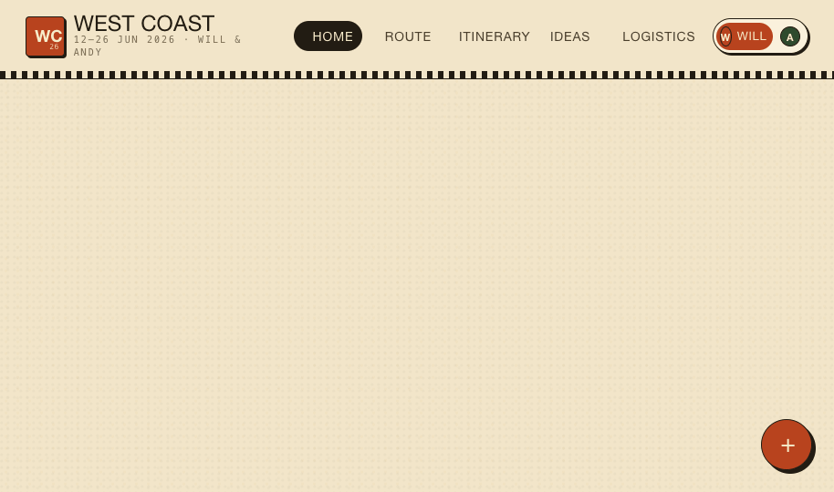

# WC2026 West Coast Trip Planner

A trip-planning web app for Will & Andy's West Coast USA road trip around the 2026 FIFA World Cup.



## What it is

A polished, offline-capable trip planner with a 70s national-park poster aesthetic. Features:

- **Home** — live countdown to the next Socceroos match, today's plan, recent activity, and pinned favorites
- **Route** — stylized poster-style map of all 8 stops with drive times and travel legs
- **Itinerary** — day-by-day timeline (Jun 12–26), editable notes, match call-outs, drag-to-assign ideas
- **Ideas** — ~150 pre-loaded ideas from Vancouver to San Jose, grouped by stop, filterable by category
- **Logistics** — hotel cards with addresses, live weather forecasts (Open-Meteo), and transfer timeline

## The trip

| # | Stop | Dates | Match |
|---|------|-------|-------|
| 1 | Vancouver, BC | Jun 12–14 | ⚽ Australia v Türkiye (Group D) |
| 2 | Seattle (Round 1) | Jun 14–16 | Fan zone |
| 3 | Olympic National Park | Jun 16–18 | — |
| 4 | Seattle (Round 2) | Jun 18–20 | ⚽ USA v Australia (Group D) |
| 5 | Portland, OR | Jun 20–21 | — |
| 6 | Crater Lake, OR | Jun 21–23 | — |
| 7 | Napa Valley, CA | Jun 23–25 | — |
| 8 | San Jose / SF | Jun 25–26 | ⚽ Paraguay v Australia (Group D) |

## Running it

Open `index.html` in any modern browser — no build step, no server required.

Or serve it with any static file server:

```bash
npx serve .
# or
python3 -m http.server 8080
```

Then open `http://localhost:8080`.

## Two-person workflow

Switch between Will (W) and Andy (A) using the avatar switcher in the top-right corner. Every pin, note, and assignment is stamped with the active user.

> **Note:** Data is stored in browser `localStorage` — each device has its own copy. For real-time shared state, a sync backend (Firebase/Supabase) would need to be added.

## Customisation

The **Tweaks** button (bottom-right) lets you switch:
- **Palette:** Ranger · Crater · Redwood · Sunset
- **Font pair:** Ranger · Souvenir · Editorial  
- **Card style:** Poster · Soft · Stamp

## Tech

Pure HTML/CSS + React 18 + Babel (CDN, no build step). All styles are inline CSS variables with a 70s National Park poster design system. Weather data from [Open-Meteo](https://open-meteo.com/) (free, no API key).
